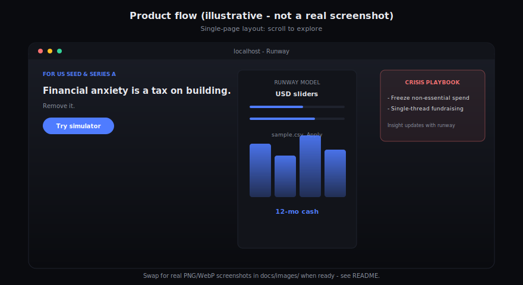
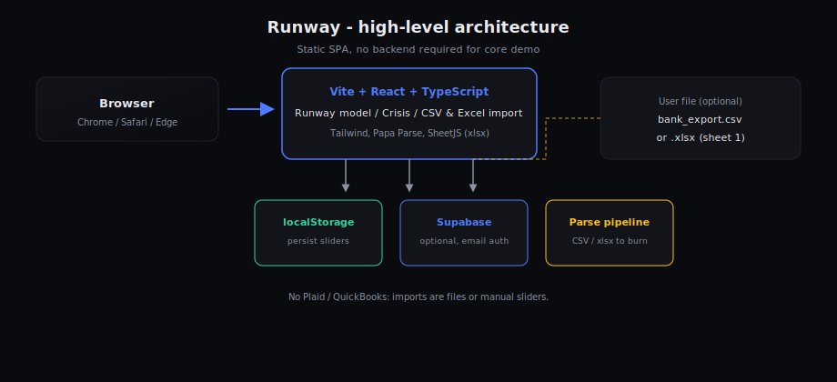

# Runway

Web prototype for **US-market** startup founders: model **cash runway, burn, and investor rhythms** in one place (USD). Runs entirely in the browser; optional cloud sync.

**Stack:** Vite 5 · React 18 · TypeScript · Tailwind · Papa Parse · SheetJS (`xlsx`) · optional Supabase.

---

## Features

| Area | What it does |
|------|----------------|
| Runway model | Cash, gross burn, MRR-style revenue, MoM growth → net burn, runway, breakeven, 12‑month chart |
| Presets | Seed / Series A / High growth |
| Import | CSV or Excel (first sheet) → inferred burn, revenue, ending balance when present |
| Crisis playbook | Actions + copy tiered by computed runway (months) |
| Hygiene | Monthly / quarterly deadline checklist |
| Data | `localStorage` by default; Supabase snapshot if `VITE_SUPABASE_*` is set |

---

## Diagrams

Illustrative SVGs (not real screenshots). Replace with PNG/WebP under `docs/images/` if you want captures.

<p align="center">
  
</p>

<p align="center">
  
</p>

---

## Getting started

```bash
npm install
npm run dev
```

Open the printed URL (usually `http://localhost:5173`). No API keys required for core flows.

```bash
npm run build    # output: dist/
npm run preview  # serve dist locally
```

Deploy **`dist/`** to any static host (Vercel, Netlify, Cloudflare Pages, GitHub Pages).

**Smoke test:** In the app, download **sample.csv** or **sample.xlsx** → **Choose CSV or Excel** → upload → **Apply to model**.

---

## Sample data

| File | Role |
|------|------|
| `public/sample-runway-transactions.csv` | Demo transactions (USD) |
| `public/sample-runway-transactions.xlsx` | Same data for Excel upload tests |

After editing the CSV, refresh the Excel artifact:

```bash
npm run generate:sample
```

---

## Optional: Supabase

1. Create a project at [supabase.com](https://supabase.com).
2. Enable **Authentication → Anonymous sign-in**.
3. Run `supabase/migrations/*.sql` in the SQL editor.
4. Copy `.env.example` to `.env` and set `VITE_SUPABASE_URL` and `VITE_SUPABASE_ANON_KEY`.

Without env vars, only **localStorage** is used.

---

## Roadmap (not in this repo)

Plaid / Stripe / QuickBooks · investor emails (e.g. Resend) · full auth (e.g. Clerk) · accounting-grade accuracy.

---

## Disclaimer

Educational prototype only. Not financial, legal, or investment advice.

---

## License

[MIT](./LICENSE). `package.json` sets `"private": true` so `npm publish` is blocked by default.
